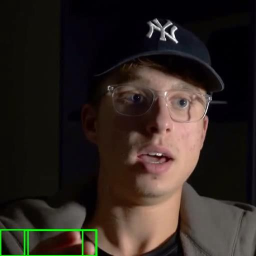
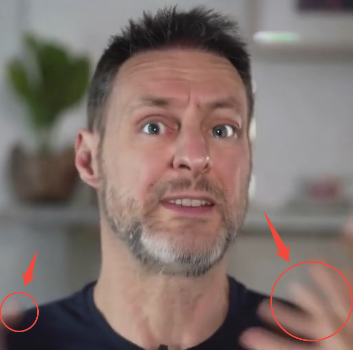

# Hands-Detection-for-Talking-Head
a hands detection tool for talking head video data preprocessing

model: grounding DINO

[](https://github.com/user-attachments/assets/fea50bd8-950b-493c-931e-ce794316e6f2)

## what can this repo do
When training talking head models, the appearance of hands in training data can put you to a lot of trouble. Especially when the model is designed for generating head area only. As a result, the model will generate videos with artifact like this:



However, most open dataset do not filter out frames with hands. So, this repo provides code for data cleaning which automatically detect and cut out video frames with hands.

## Usage

### Installation

```bash
## for env: transformer==4.49.0 is needed for grounding DINO
git clone https://github.com/progrobe/Hands-Detection-for-Talking-Head.git
cd Hands-Detection-for-Talking-Head
```

### Download Pretrained Grounding DINO

```bash
huggingface-cli download --resume-download Download Pretrained Models  --local-dir ./weights
```

### Single video detection
Simply run the single_v_hand_detect.py and pass your video path and output path as input:
```bash
python single_v_hand_detect.py -i path_to_your_video -o output_dir_path --cut
```
use `--cut` to crop video. use `--demo` to visualize detection result. use `--verbose` to print bboxes detected, hand-frame idx and the ratio of hand-frames in this video.

use `--min_frame_num` to set the minimal frames of output video clips, which means hands-free subclips with of less that min_frame_num will be discarded.

### Video detection for dataset
1. Put all your videos to be clean under a directory.
2. Simply run the batch_v_hand_detect.py and pass this video dir and output dir as input:
```bash
python batch_v_hand_detect.py -i video_directory -o output_dir_path --cut
```

use `--cut` to crop video. use `--demo` to visualize detection result. use `--verbose` to print bboxes detected, hand-frame idx and the ratio of hand-frames in this video.

use `--min_frame_num` to set the minimal frames of output video clips, which means hands-free subclips with of less that min_frame_num will be discarded.

To speed up, use `--skip` to apply detection every n frames, instead of every frame. Or you can use  `--batch_size` to set a proper batch size for your GPU.

## now your model will not produce artifacts of hand


