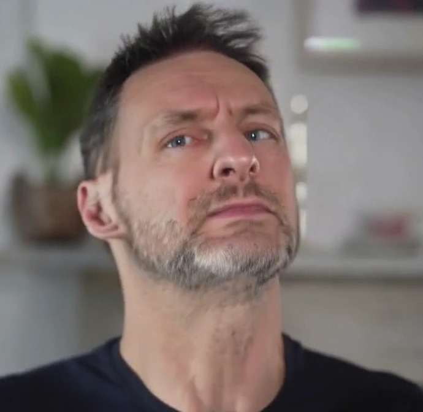

# Hands-Detection-for-Talking-Head
A Hands Detection Tool for talking head video data cleaning and preprocessing. Also for finger detection in video.

Model used: grounding DINO [[`Grounding DINO`](https://arxiv.org/abs/2303.05499)] 

[](https://github.com/user-attachments/assets/fea50bd8-950b-493c-931e-ce794316e6f2)

## what can this repo do
When training a talking head video gerenation model, the appearance of hands in training data can cause much trouble, especially when this model is supposed to generating head area only. If the dataset is not clean enough, the model might generate videos with artifact like this:


So, this repo provides code for data cleaning. It can automatically detect and cut out video frames with hands.

## Usage

### Installation

```bash
## for env: transformer==4.49.0 is needed for grounding DINO
git clone https://github.com/progrobe/Hands-Detection-for-Talking-Head.git
cd Hands-Detection-for-Talking-Head
```

### Download Pretrained Grounding DINO

```bash
huggingface-cli download --resume-download Download Pretrained Models  --local-dir ./weights
```

### Single video detection
Simply run the single_v_hand_detect.py and pass your video path and output path as input:
```bash
python single_v_hand_detect.py -i path_to_your_video -o output_dir_path --cut
```
use `--cut` to crop video. use `--demo` to visualize detection result. use `--verbose` to print bboxes detected, hand-frame idx and the ratio of hand-frames in this video.

use `--min_frame_num` to set the minimal frames of output video clips, which means hands-free subclips with of less that min_frame_num will be discarded.

### Video detection for dataset
1. Put all your videos to be clean under a directory.
2. Simply run the batch_v_hand_detect.py and pass this video dir and output dir as input:
```bash
python batch_v_hand_detect.py -i video_directory -o output_dir_path --cut
```

use `--cut` to crop video. use `--demo` to visualize detection result. use `--verbose` to print bboxes detected, hand-frame idx and the ratio of hand-frames in this video.

use `--min_frame_num` to set the minimal frames of output video clips, which means hands-free subclips with of less that min_frame_num will be discarded.

To speed up, use `--skip` to apply detection every n frames, instead of every frame. Or you can use  `--batch_size` to set a proper batch size for your GPU.

### about thresholds
`--box_threshold` is set to be 0.2 and `--text_threshold` is set to be 0.1 by default. This threshold is capable of detecting almost all hands and fingers even if they are ghost image or only part of them is in the video.
Since we don't need accurate bbox of fingers and hands, set these thresholds lower is also okay.

## now your model will not produce artifacts of hand


hope this repo can help you
